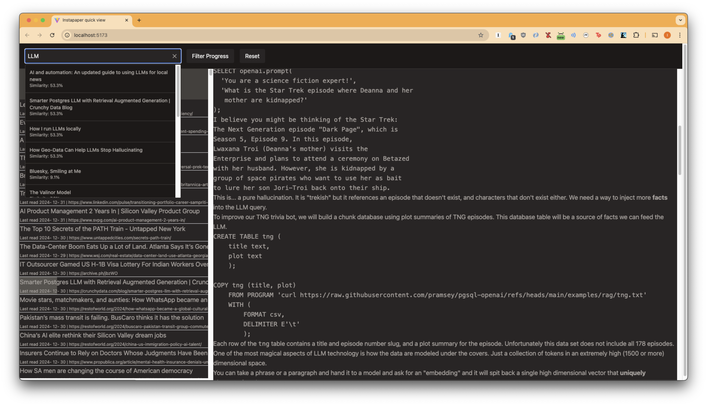

# Instapaper Management App



A web application for managing your Instapaper bookmarks with a clean interface and keyboard shortcuts. The nice thing is this stores past the 500 article limit you normally get back from the API

## Features

- View all Instapaper bookmarks in a list
- Read bookmark content directly in the app
- Archive bookmarks
- Star/unstar bookmarks
- Track reading progress
- Keyboard navigation
- SQLite storage for offline access

## Setup

1. Install dependencies:
```bash
npm install
```

2. Create a `.env` file with your Instapaper credentials:
```
INSTAPAPER_CLIENT_ID=your_client_id
INSTAPAPER_CLIENT_SECRET=your_client_secret
INSTAPAPER_EMAIL=your_email
INSTAPAPER_PASSWORD=your_password
```

3. Create SQLite database schema:
```sql
CREATE TABLE articles (
    title TEXT,
    url TEXT,
    text TEXT,
    hash TEXT,
    bookmark_id INTEGER PRIMARY KEY,
    time INTEGER,
    progress_timestamp INTEGER,
    progress REAL,
    archived BOOLEAN
);
```

4. Populate DB

```bash
node load-articles.js
```

## Usage

Start the server:
```bash
node index.js
```

The app will be available at `http://localhost:3000`

### Keyboard Shortcuts

- `j` - Move selection down
- `k` - Move selection up
- `l` - Toggle star
- `Enter` - View article text
- `Backspace` - Archive article
- `0` - Jump to top
- `r` - Select random article

## Architecture

- Backend: Express.js server with SQLite database
- Frontend: Svelte application
- API: Instapaper SDK for Node.js

## Data Flow

1. Initial load syncs bookmarks from Instapaper to local SQLite database
2. Frontend communicates with Express backend for data operations
3. Changes are persisted to both local database and Instapaper through the API
